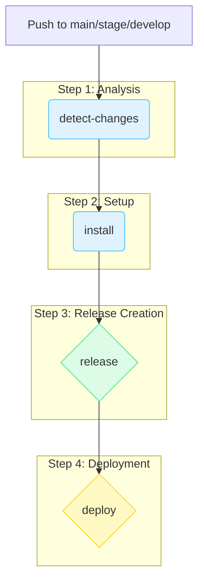

# GitHub Workflows: Automation & CI/CD

This directory contains all GitHub Actions workflows for automating code quality, releases, and deployments in this monorepo.

## Table of Contents

- [Workflow Overview](#workflow-overview)
  - [`lint.yml` (Code Quality Check)](#lintyml-code-quality-check)
  - [`ci.yml` (CI, Release & Deploy)](#ciyml-ci-release--deploy)
- [Required Setup](#required-setup)
  - [GitHub Environments](#github-environments)
  - [Repository & Environment Secrets](#repository--environment-secrets)
- [Workflow Breakdown (`ci.yml`)](#workflow-breakdown-ciyml)

---

## Workflow Overview

### `lint.yml` (Code Quality Check)

This workflow acts as our "Quality Gatekeeper".

-   **Trigger:** Runs on every pull request targeting the `main`, `stage`, or `develop` branches.
-   **Purpose:** Ensures that all new code adheres to the project's defined linting and formatting rules.
-   **Action:** Executes `pnpm lint:check`, which uses [Biome.js](https://biomejs.dev/) to inspect the code.
-   **Outcome:** If the code does not comply with the rules, the workflow fails, blocking the pull request from being merged.

✅ **No special configuration is required for this workflow.**

### `ci.yml` (CI, Release & Deploy)

This is the main pipeline for Continuous Integration, Release Management, and Deployment.

-   **Trigger:** Runs on every every pull request to the `main`, `stage`, or `develop` branches.
-   **Purpose:** Automates the entire lifecycle from code change to deployment.
-   **Actions:**
    1.  **Detects Changes:** Determines which parts of the monorepo (`frontend`, `backend`) have been modified.
    2.  **Creates Releases:** Uses `semantic-release` to automatically create new version numbers, generate changelogs, and set Git tags.
    3.  **Triggers Deployments:** Calls webhooks to deploy the new versions to the appropriate environment (Stage or Production).

⚠️ **This workflow requires mandatory configuration of Environments and Secrets to function correctly.**

---

## Required Setup

For the `ci.yml` workflow to operate, specific environments and secrets must be configured in the GitHub repository.

### GitHub Environments

This template leverages GitHub Environments to securely manage configuration and secrets between `stage` and `production`.

1.  In your GitHub repository, navigate to `Settings > Environments`.
2.  Create two new environments:
    -   `stage`
    -   `production`

For each environment, you can set specific secrets and protection rules.

### Repository & Environment Secrets

The following secrets must be configured.

| Secret Name | Description | Location |
| :--- | :--- | :--- |
| `SEMANTIC_RELEASE_TOKEN` | A [Personal Access Token (Classic)](https://github.com/settings/tokens/new) with `repo` and `write:packages` scopes. Required by `semantic-release` to create releases, push tags, and publish packages. | **Repository Secret:** `Settings > Secrets and variables > Actions` |
| `COOLIFY_TOKEN` | An API token for your deployment service (e.g., Coolify). Used to authenticate the deployment webhook calls. | **Repository Secret:** `Settings > Secrets and variables > Actions` |
| `BACKEND_DEPLOY_WEBHOOK_URL` | The deployment webhook URL for the backend service. This is called to trigger a new deployment of the backend. | **Environment Secret:** Set this secret within both the `stage` and `production` environments you created. |
| `FRONTEND_DEPLOY_WEBHOOK_URL` | The deployment webhook URL for the frontend service. This is called to trigger a new deployment of the frontend. | **Environment Secret:** Set this secret within both the `stage` and `production` environments you created. |

---

## Workflow Breakdown (`ci.yml`)

The `ci.yml` workflow is divided into four logical jobs that depend on each other.

1.  **`detect-changes`**: Checks which application folders (`apps/frontend`, `apps/backend`, `packages/database`) are affected by the changes in the push. It passes the result to subsequent jobs.
2.  **`install`**: Installs all `pnpm` dependencies and caches them to speed up subsequent jobs.
3.  **`release`**: If changes were detected, this job runs. It uses `semantic-release` to create a new version for the frontend and/or backend based on the commit messages.
4.  **`deploy`**: If a new version was successfully released, this job triggers the corresponding deployment webhook(s) for the `stage` or `production` environment, depending on the branch.